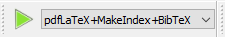

# REPORT at Corporate IT Infrastructure Project

# Installation Guide

1. Install LaTex from this link: https://miktex.org/download

2. Clone the repository (.tex file and /images folder)

3. Open the LaTex, go: File -> Open -> Choose .tex file

4. Pick the right compiler

5. Click green button (shape of triangle)
